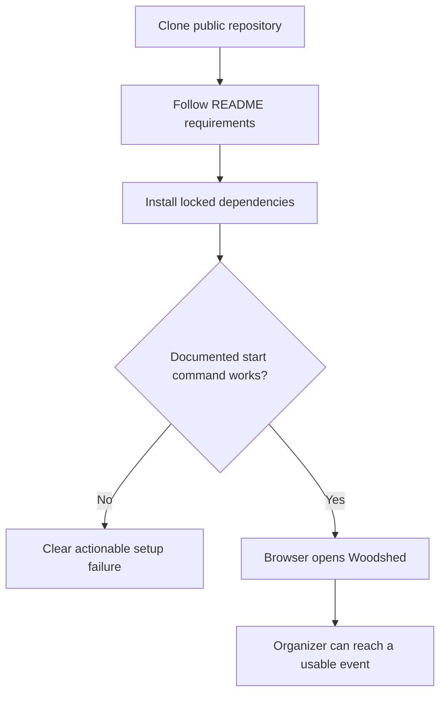
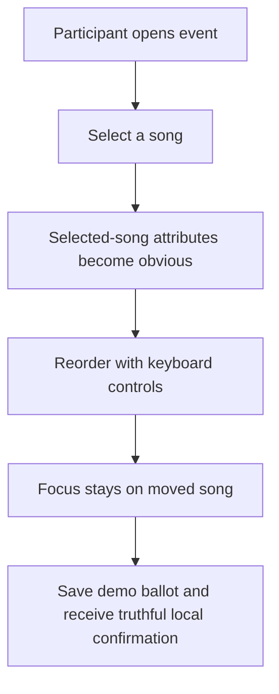
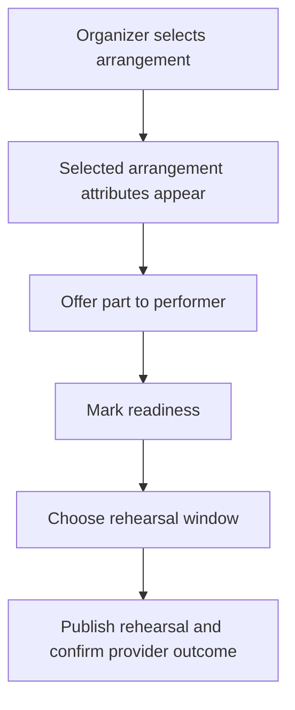
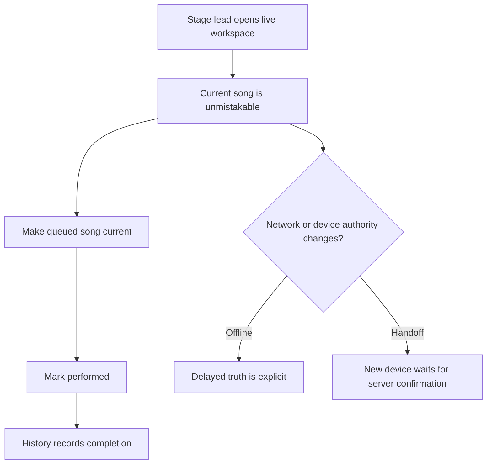

# Dogfood Report — dogfood/clean-install

> Release-scoped browser QA of the initial public Woodshed history. Generated by `ce-dogfood` on 2026-08-09.

## Diff Summary

- Clean-history public Woodshed foundation with synthetic data only.
- Participant ranked-ballot UI with explicit selected-song context.
- Staffing and rehearsal coordination UI with selected-arrangement context.
- Offline-aware live stage-lead UI with authority and performance history.
- Node/SQLite API reference runtime plus an experimental Cloudflare adapter.

## Personas

No checked-in strategy or persona document exists yet, so these personas are inferred from the accepted product contract.

- **Participatory event organizer** — needs to create an event, collect choices, prepare performers, and run the show without developer help.
- **Audience participant** — needs to join quickly, understand privacy, rank songs, and submit a new choice.
- **Performer or stage lead** — needs clear assignments, rehearsal readiness, and safe queue control under poor connectivity.

## Flows Tested

## Test Matrix & Results

| # | Flow | Journey / Scenario | Status | Issue | Fix | Commit |
|---|------|--------------------|--------|-------|-----|--------|
| 1 | Install | Fresh clone, locked install, documented startup | Fixed | README had verification commands but no way to start either runtime. | Added locked-install, Vite, and Node API instructions with prototype limitations. | This branch |
| 2 | Participant | Selected-song context and mouse reorder | Pass | - | - | - |
| 3 | Participant | Keyboard reorder, focus retention, live announcement | Pass | - | - | - |
| 4 | Participant | Save ballot and propose a song | Fixed / limited | Both controls were inert, while the page looked production-connected. | Added visible local-demo state, save/proposal confirmation, and reset-on-refresh disclosure. Durable API persistence remains a human product decision. | This branch |
| 5 | Rehearsal | Select arrangement, offer part, mark readiness | Pass | - | - | - |
| 6 | Rehearsal | Choose and publish rehearsal | Pass / synthetic | Interaction and feedback pass; provider delivery remains an intentionally synthetic seam. | - | - |
| 7 | Live | Change current song, perform it, inspect history | Pass | - | - | - |
| 8 | Live | Offline status and authority handoff states | Fixed / limited | The initial prototype could continue saying “Everything synced” after an offline transition. | Added browser online/offline event handling and explicit connection/lease freshness copy. Real API-backed authority remains outside this prototype. | This branch |
| 9 | Cross-cutting | Mobile layout and touch targets | Pass | 390×844 layout preserved clear selected-event and adjacent-event hierarchy. | - | - |
| 10 | Cross-cutting | Keyboard landmarks, labels, console and network errors | Pass with manual contrast review | Axe reported 0 violations and 1 incomplete contrast check for four move buttons; no application console/page errors appeared. | - | - |

## What Was Fixed

- Added a truthful, visually prominent “Interactive prototype” notice.
- Added startup instructions that work from a fresh public clone.
- Made ballot save and song proposal controls produce explicit local-demo feedback.
- Made live status react deterministically to browser online/offline events.
- Added regression coverage for demo persistence messaging, proposals, and offline truth.

## Paper Cuts (by persona)

- **Organizer:** The page presents participant, rehearsal, and live surfaces together. This is useful as a product-shape prototype, but it is not yet a task-focused organizer shell.
- **Participant:** Privacy and selected-song context are strong; before the fix, save/proposal controls offered no result or persistence boundary.
- **Stage lead:** Current/queued/performed distinctions are strong; network truth needed to be more explicit during disconnects.

## Console Errors

No application errors were observed. The console contained only normal Vite connection and React development-mode informational messages.

## Human Verifications

- Manually review move-button foreground/background contrast in the final supported browser/theme matrix; Axe could not compute the four states automatically.
- Test real provider OAuth/calendar delivery only after a credentialed adapter exists.
- Validate real stage-lead device loss and server-confirmed handoff only after the browser is connected to the live API.

## Decisions for a Human

### Connect the browser prototype to the APIs now, or preserve it as an explicit prototype?

- **Option A:** Wire invite/session bootstrap, ballots, proposals, coordination, and live authority into the current page immediately.
- **Option B:** Keep this initial public release explicitly synthetic, then implement API-backed onboarding as the next vertical slice.
- **Recommendation:** Option B. The current disclosure is truthful and the interaction model is valuable; a partial connection would be more misleading and riskier than a deliberately scoped integration unit with two-runtime conformance.

## Learnings

- Selected-context cards read clearly on desktop and mobile and solve the original adjacent-item ambiguity.
- A polished prototype needs persistence labels just as much as production software; otherwise a working-looking control overpromises.
- Offline truth should be driven by explicit connectivity transitions and server freshness, not styling alone.
- Clean-clone dogfood is essential for a public repository: internal verification commands do not substitute for a newcomer’s startup path.

## Final Status

**Pass with a bounded product decision.** The public foundation installs cleanly, the synthetic participant/rehearsal/live journeys are usable and accessible, and the dogfood-discovered truthfulness defects are fixed with tests. Publication-quality claims must continue to call the UI a prototype until the browser is connected to durable APIs.
